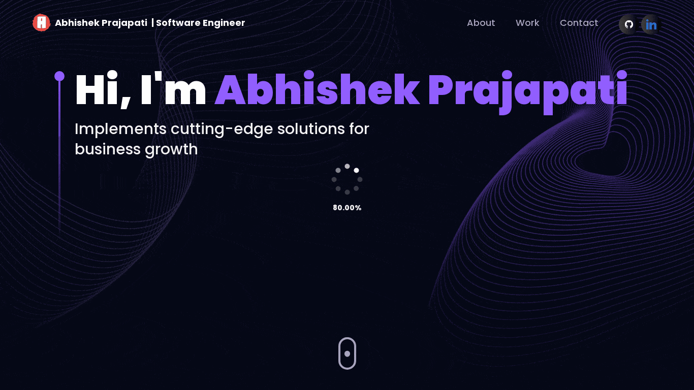

<div align="center">
  
  
  
  
  [](https://github.com/abhishekprajapati29/portfolio/commits/main)
  [](https://abhishekprajapati.onrender.com/)
  [](https://www.linkedin.com/in/abhishekprajapati29/)
  [](http://badges.mit-license.org)

  <br />
  <br />
  
  

  <h2 align="center">Abhishek Prajapati - Personal portfolio</h2>

Welcome to my digital showcase! This portfolio represents my journey and expertise in the world of software development, showcasing a variety of projects and technologies. Feel free to explore and get to know more about my skills and experiences.

<a href="https://abhishekprajapati.onrender.com"><strong>➥ Portfolio Live</strong></a>

</div>

<br />

## 🔥 Website Preview


## 📋 Features
⚡️ Modern UI Design + Reveal Animations\
⚡️ Made with React\
⚡️ Fully Responsive\
⚡️ Easily Customizable\
⚡️ Well organized documentation

## 💡 Tech Stack
- [React](https://reactjs.org/)
- [TypeScript](https://www.typescriptlang.org/)
- [Apollo Client](https://www.apollographql.com/docs/react/)
- [Three.js](https://threejs.org/)
- [Framer Motion](https://www.framer.com/motion/)
- [React Router](https://reactrouter.com/)
- [Vite](https://vitejs.dev/)
- And more...

## 📚 Sections 
✔️ About\
✔️ Work Experience\
✔️ Skills \
✔️ Projects \
✔️ Projects \
✔️ Skills \
✔️ Resume\
✔️ Contact Info


## 🛠️ Prerequisites
Before you begin, ensure you have met the following requirements:

- [Git](https://git-scm.com/downloads "Download Git") must be installed on your operating system.
- npm (comes with Node.js) or yarn (Recommended: [Yarn](https://yarnpkg.com/))

## ⭐ Environment Variables
To run the project locally, you need to set up the following environment variables. Create a `.env` file in the root of your project and add the following:

```env
VITE_APP_EMAILJS_SERVICE_ID=<EMAILJS_SERVICE_ID>
VITE_APP_EMAILJS_TEMPLATE_ID=<EMAIL_TEMPLATE_ID>
VITE_APP_EMAILJS_PUBLIC_KEY=<PUBLIC_KEY>
```


## 📦 Installation
1. **Clone the repository:**

   ```bash
   git clone https://github.com/your-username/portfolio.git
   ```
   
2. **Navigate to the project directory:**

   ```bash
   cd portfolio
   ```
   
3. **Install dependencies:**

   ```bash
   npm install   # or yarn install
   ```
   
4. **Start the development server:**

   ```bash
   npm start     # or yarn start
   ```
   
4. **Deployment:**
   To deploy your website, first you need to create github repository with name `<your-github-username>.github.io` and push the generated code to the `master` branch.


## 📂 Project Structure
- `/src`: Contains the source code for the portfolio.
  - `/components`: Reusable React components.
  - `/sections`: Sections of the portfolio (About, Experience, Tech, Works, Contact).
  - `/assets`: Images, styles, and other static assets.

## 🤝 Contributing

Feel free to contribute to this project! Whether it's reporting bugs, suggesting enhancements, or adding new features, your contributions are welcome. Please follow the [contribution guidelines](CONTRIBUTING.md).

### 📝 License

This project is licensed under the [MIT License](LICENSE).

---

Thank you for visiting my portfolio! If you have any questions or suggestions, feel free to reach out.

[Back to Top](#abhishek-prajapatis-portfolio)
